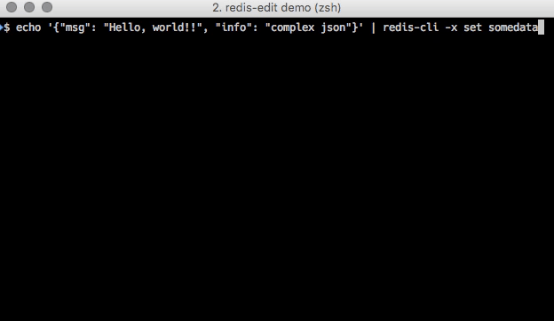

redis-edit
==========

This Redis utility will get a key and open it in your favorite EDITOR, when
changes were made it will write the change back to the same Redis key.

For editing the environment variable EDITOR is used or a few defaulted editors
are tried (like nano).

To edit more complex data types redis-edit will convert the data into a JSON
representation which can be edited and is converted back when written to Redis.


Installation
------------
With [Golang](https://golang.org/) installed:
```
go get -u github.com/koenbollen/redis-edit
redis-edit --help
```

Example
-------


Usage
-----
```
  redis-edit [options] <key>
  redis-edit (--help | --version)

This Redis utility will get a key and open it in your favorite EDITOR, when
changes were made it will write the change back to the same Redis key.

For editing the environment variable EDITOR is used or a few defaulted editors
are tried (like nano).

To edit more complex data types redis-edit will convert the data into a JSON
representation which can be edited and is converted back when written to Redis.

Arguments:
  <key>              The redis key to edit. Currently only the following types
                     are supported: string, list, set, hash, zset
Options:
  --help             Show this screen.
  --version          Show version.
  -h <hostname>      Server hostname [default: 127.0.0.1].
  -p <port>          Server port [default: 6379].
  -s <socket>        Server socket (overrides hostname and port).
  -a <password>      Password to use when connecting to the server.
  -n <db>            Database number [default: 0].
  -r --raw           Raw writes, don't validate edits (only for string)
```
